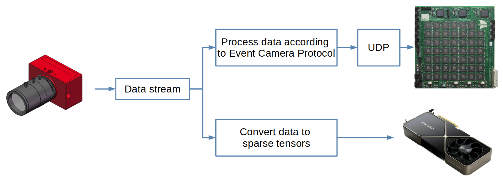

# DVSStream - Streaming and Converting DVS data

DVSStream allows for processing (real-time) DVS data from an event-based DVS camera. At the current stage, DVSStream can be used for the following two purposes: 

- Polarity events from a DVS camera (that is connected via USB) are encoded and sent over ethernet to the SpiNNaker SPIF board, where they are [processed further](https://github.com/SpiNNakerManchester/spif). 

- Polarity events from a DVS camera (that is connected via USB) are transformed to a [sparse tensor](https://pytorch.org/docs/stable/sparse.html) format for further usage. This setting exports to Python, i.e. a data generator can be constructed in Python which allows for iterating over (real-time) polarity events in sparse tensor format. 



## Setup

DVSStream requires [libcaer](https://github.com/inivation/libcaer), [LZ4](https://lz4.github.io/lz4/), and [libtorch](https://pytorch.org/cppdocs/installing.html).

To build the binaries of this repository, run the following code:
```
export CMAKE_PREFIX_PATH=`absolute path to libtorch/`
mkdir build/
cd build/
cmake -GNinja ..
ninja
```

## Python bindings

The Python bindings require that you have installed a version of pytorch, and lz4. One
way of ensuring these requirements is by installing them as conda packages:
```shell
conda install pytorch
conda install lz4
```

In order to build and install the python bindings run:
```
cd src
python setup.py install --record setup_files.txt
```
this assumes that you have pytorch >= 1.5.1 installed. In case of any complications, the module can be easily removed running the following command:
```
xargs rm -rf < setup_files.txt
```

## List DVS cameras connected to device
To obtain a list of all DVS cameras connected to the current device run the following code (taken from [libcaer](https://github.com/inivation/libcaer)):
```
gcc -std=c11 -pedantic -Wall -Wextra -O2 -o device_discovery device_discovery.c -D_DEFAULT_SOURCE=1 -lcaer
```

## Stream polarity events via ethernet to server
DVSStream can be used to stream DVS camera data via ethernet using UDP. The server can be specified by the port number and IP-Address. To run the script use:

```
src/stream2ethernet <max. packet size> <number of packets to send> (Optional: <camera type> <USB id> <device Address> <port> <IP Address>)
```

As you might notice, the script requires 2 command line arguments `uint32_t <max. packet size>` and `uint32_t <number of packets to send>` where the first argument specifies the maximum number of events in one packet processed by [libcaer](https://github.com/inivation/libcaer) and the latter the number of packets to be sent. In addition, there are 4 optional arguments that can be provided. The argument `*char <camera type>` specifies the type of the camera that is about to be used. Default is `camera type = davis` that can be used for the *Davis 346x260*. To use the *DVXplorer 640x480* specify `camera type = dvx`. The argument  `int <USB id>` serves as a unique USB port identifier. Similarly, the argument `int <device Address>` identifies the device address. Default is `USB id = 1`. The arguments `int <port>` and `*char <IP Address>` specify the port number and IP-Address of the server. Defaults are `port = 3333` and `IP Address = NULL`. An IP-Address of `NULL` represents the address of the host computer.

## Convert polarity events to sparse tensors
DVSStream can be used to translate polarity events from a DVS camera into sparse tensor format. To do so, run the script:

```
src/stream2tensor <max. packet time in μs> <buffer size> <number of packets to process>
```

where `<max. packet time in μs>` is the maximum time length of a packet processed by [libcaer](https://github.com/inivation/libcaer) in mikroseconds. `<buffer size>` spcifies the size of the internal ring buffer that stores DVS packets if they are not processed fast enough. Note that this number as to be a multiple of 2 (e.g. 512). The last argument `<number of packets to process>` specifies the number of packets to be translated to sparse tensors.


### Usage in python
It is possible to create a python [generator](https://wiki.python.org/moin/Generators) that allows to iteratively obtain polarity events in sparse tensor format from the DVS camera. An example of such a generator can be in [DVSGenerator.py](export2python/DVSGenerator.py). 

To run this script use:
```
python export2python/DVSGenerator.py --packet_size  <max. packet time in μs> --buffer <buffer size> --events <number of packets to process>
```

where the arguments match the above descriped arguments. 

## Acknowledgments

- This library is based on [libcaer](https://github.com/inivation/libcaer) by iniVation AG.
- The conversion of polarity events to sparse tensors is based on the [AEDAT](https://github.com/norse/aedat) library by Christian Pehle and Jens. E. Pedersen.